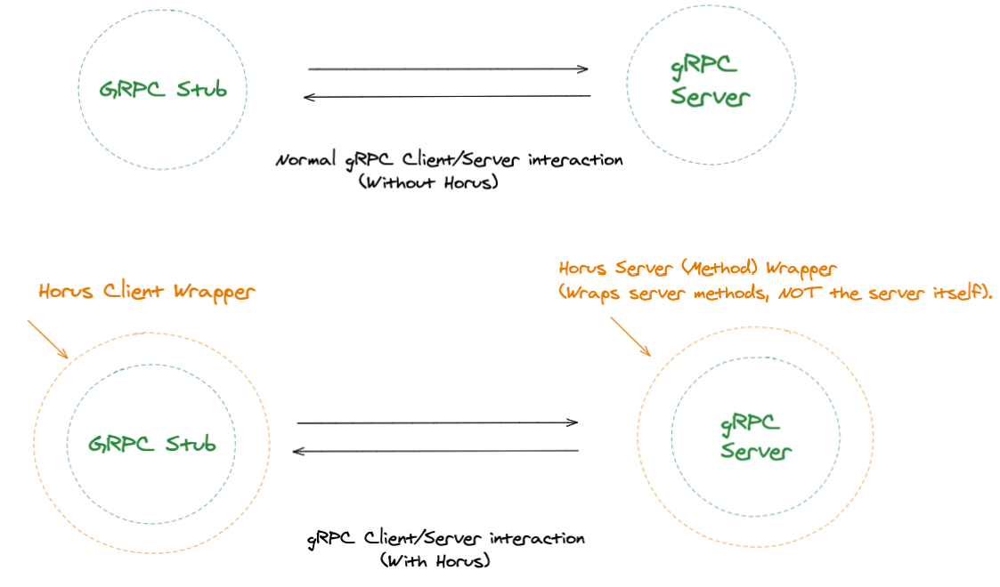
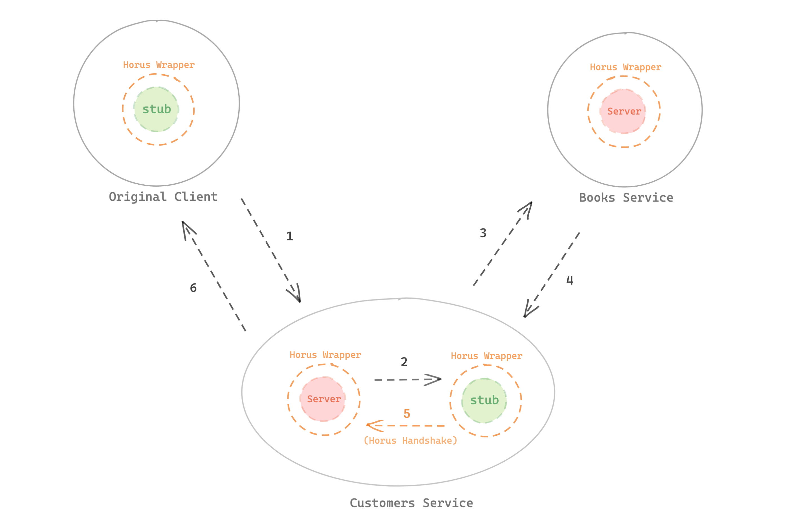
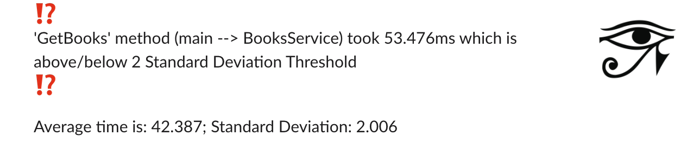
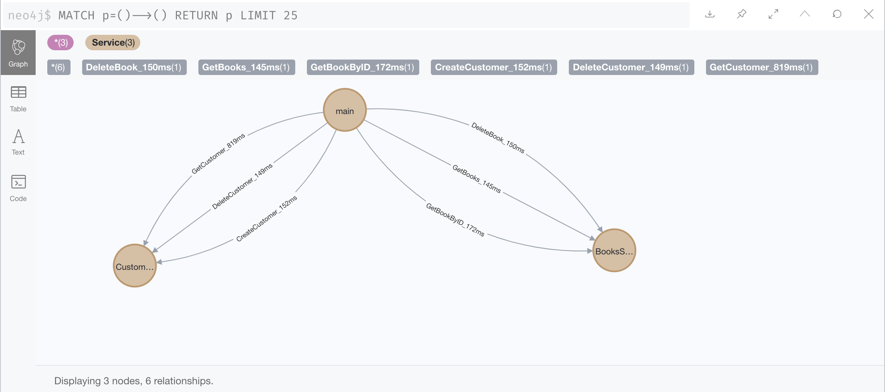

<p align="center">
  
</p>
</br>
<h1 align="center">HORUS</h1>

<p align="center">
  
   
   <a href="https://github.com/Rchan0100/Test-README/edit/master/README.md">
    
   </a>                                                      
</p>

<p align="center"> 
  <br/>
  <b>A Distributed Tracing and Monitoring Tool for gRPC-Node Applications</b> 
  <br/>
</p>
<br/>

# What is Horus?

<b>Horus</b> is a Distributed Tracing and Monitoring Tool for gRPC-Node Applications. 


Our team aims to provide the user a seamless experience in adding tracing and monitoring functionality to their application with our NPM Packages!<br/><br/>


<b>Core Features</b> :zap:
- Horus traces, logs and monitors gRPC requests. Tracing and logging features include:
    1. Provides data on which gRPC method was called for a specific gRPC request.
    2. How long it took to complete the gRPC request.
    3. Date/Time of Completion.
    4. Traces any additional Intraservice Requests that were made in completing that request.
    5. Request data will be outputted in a text file (but users can also visualize the data with our Neo4J Integration.)
- Alerts user whenever gRPC request times go beyond a threshold of (+/-) 2 STD of its average request time using Slack Webhooks.
- We provide a mock-microservice which performs gRPC requests AND <b>intraservice gRPC requests</b> between 2 different services. 
- Neo4j Integration to visualize data.
<br/>

<b>The Mock-Microservice app. (in master branch) that we provide is a <b>bookstore app.</b> with the following services: </b>
<br/>
- Books Service
- Customers Service
<br/>

<b>\*\*\*Check out our GitHub Repo for Step-By-Step Guides, Explanations, API, and more: https://github.com/oslabs-beta/Horus/\*\*\*</b>

And yes, it does support intraservice gRPC requests! (Check out our setup tutorial in the table of contents below).

<br/>

*All modules can be found under the npm organization @horustracer.*
*If you have any questions, please reach out to the team at: HorusTracerOfficial@gmail.com*

<br/>

## Table of Contents

* [Installation](#Installation)

* [Branch Information](#Branch-Information)

* [Step-by-Step Tutorial for Horus](#Step-By-Step-Tutorial-for-Horus) 

* [Monitoring Features and Setup](#Monitoring-Features-and-Setup)

* [API Documentation](#Api-Documentation)

* [Setting up Mock-Microservice App. with Horus (Which we provide)](#Setting-up-Mock-Microservice-With-Horus)

* [Setting up Neo4j for Visualizing Request Data](#Setting-Up-Neo4j-for-Visualizing-Request-Data)

* [Future Features](#Future-Features)

* [Contributing](#Contributing)

* [License](#License)

* [Authors](#Authors)

<br/>
<br/>

# Installation


Installing Horus into your application is quick and easy. 
<br>
<b>Follow the steps below</b> to set up the <b>ClientWrapper, ServerWrapper, and any intraservice requests</b> that you have. 

*For a more in depth guide to installing Horus, check the tutorial right below the installation section.*

<b>NPM Installation: </b>
```js
npm install @horustracer/ClientWrapper //(Mandatory)
npm install @horustracer/ServerWrapper //(Mandatory)
npm install @horustracer/Visualizer //(optional, for Neo4J integration to visualize request data.)
            
or 
            
npm install @horustracer/ClientWrapper @horustracer/ServerWrapper @horustracer/Visualizer
```
<br/>

<b>1. Setting up the ClientWrapper</b>
<br/>

- Import the ClientWrapper from @horustracer/ClientWrapper into your stub (gRPC client) file. 
- Initialize a new instance of the ClientWrapper, passing in the gRPC client, service and output text file name. 
- Then export the ClientWrapper in the place of your previous stub.

```js
const HorusClientWrapper = require('@horustracer/ClientWrapper');
const grpc = require("grpc");
const protoLoader = require("@grpc/proto-loader");
const path = require('path');
const PROTO_PATH = path.join(__dirname, "../protos/books.proto");

const packageDefinition = protoLoader.loadSync(PROTO_PATH, {
  keepCase: true,
  longs: String,
  enums: String,
  arrays: true
});

const BooksService = grpc.loadPackageDefinition(packageDefinition).BooksService;

const client = new BooksService (
  "localhost:30043",
  grpc.credentials.createInsecure()
);

//process.env.HORUS_DB utilizes environment variables. You can replace it with your MongoDB URI.
//process.env.SLACK_URL utilizes environment variables. You can replace it with your SLACK URL.
const ClientWrapper = new HorusClientWrapper(client, BooksService, 'books.txt', 'main', `${process.env.HORUS_DB}`, `${process.env.SLACK_URL}`);

module.exports = ClientWrapper;
```
<br/>

<b>2. Setting up the ServerWrapper</b>
<br/>

- Import the ServerWrapper into your server file. 
- Rather than invoking the server.addService method, create a new instance of the ServerWrapper, passing in the server, proto, and methods as arguments.

```js
const HorusServerWrapper = require('@horustracer/ServerWrapper);
const grpc = require('grpc');
const protoLoader = require("@grpc/proto-loader");
const path = require('path');
const controller = require("./booksController.js");
const PROTO_PATH = path.join(__dirname, '../protos/books.proto');

const ServerWrapper = new HorusServerWrapper(server, booksProto.BooksService.service, {
  CreateBook: async (call, callback) => {
    const book = call.request;

    let result = await controller.CreateBook(book);

    callback(null, result);
})

server.bind("127.0.0.1:30043", grpc.ServerCredentials.createInsecure());
server.start();
```
<br/>

<b>3. Intraservice Requests</b>
<br/>

- <b>***If you don't have any intraservice requests, you're all done and can skip this part.***</b>
- If you do, invoke the makeHandShakeWithServer method in your intraservice request's callback. The makeHandShakeWithServer method lives on the ClientWrapper. It's first argument is the ServerWrapper it's being invoked in and the second is the name of the intraservice request. (Remember because of part 1, your stub should be exporting the ClientWrapper rather than the gRPC client);

```js
const HorusServerWrapper = require('@horustracer/ServerWrapper);
const booksStub = require('../stubs/booksStubs.js)

const CustomerServerWrapper = new HorusServerWrapper(server, customersProto.CustomersService.service, {
  GetCustomer: async (call, callback) => {
    const customerId = call.request;

    const customer = await controller.GetCustomer(customerId);

    const customersFavoriteBookId = {favBookId: customer.favBookId};

    booksStub.GetBookById(customersFavoriteBookId, (error, response) => {

      booksStub.makeHandShakeWithServer(CustomerServerWrapper, 'GetBookById');

      callback(null, result);
    });
})
```

Once you have completed this step for your intraservice requests, you're all done.

<br/>

[↥Back to top](#Table-Of-Contents)

<br/>


# Branch Information

- Master - Includes Mock-Microservice, supports Intraservice Request.
- Staging - Staged version of master. Think of it like a draft of the master branch. .
- Package Branch - Includes source code for our 3 NPM packages.
    1. @horustracer/ClientWrapper
    2. @horustracer/ServerWrapper
    3. @horustracer/Visualizer


To iterate fork to your own repository and submit PRs. 
  
Click [here](#Contributing) to see different ways of contributing.


<br/>

[↥Back to top](#Table-Of-Contents)

<br/>


# Step-by-Step Tutorial For Horus

<b> *Note: This does NOT include setting up the Mock Microservice Application. Check that section below, if you're interested in running the mock microservice application with the Horus Tool.* </b>
<br/>

Installing Horus into your application is quick and easy. 
Follow the steps below to set up the <b>ClientWrapper</b>, <b>ServerWrapper</b>, and any <b>intraservice handshake functions</b> you may need.

<br/>

<b>1. Setting up the ClientWrapper</b>
<br/>

The Horus ClientWrapper does its magic by "wrapping" your preexisting gRPC stub (gRPC client). Think of it as a middleman which lives between you (the developer) and your stub. Horus uses a similar approach for the ServerWrapper, except it wraps your server methods rather than the gRPC server itself.

<br/>
<p align="center">
  
</p>
<br/>

Install the ClientWrapper by running npm install @horustracer/ClientWrapper. Then "require" in the ClientWrapper into your stub (gRPC client) file.

```js

// run "npm install @horustracer/ClientWrapper" in your terminal

const HorusClientWrapper = require('@horustracer/ClientWrapper')

```
<br/>

Now install and require in the grpc, @grpc.proto-loader, and path modules as you normally would. 
Using grpc.proto-loader, we are dynamically generated code from the proto files. This is opposed to static generation of code using the protoc compiler.

We installed the 'path' module to help us get the path of where the .proto file is located in your file system.

<br/>

```js

// run "npm install grpc @grpc/proto-loader path" 

const HorusClientWrapper = require('@horustracer/ClientWrapper');
const grpc = require("grpc");
const protoLoader = require("@grpc/proto-loader");
const path = require('path');
const PROTO_PATH = path.join(__dirname, "../protos/books.proto");

```
<br/>

Next set up your package definition, service, and client as you normally would with gRPC.

<br/>

```js

const HorusClientWrapper = require('@horustracer/ClientWrapper');
const grpc = require("grpc");
const protoLoader = require("@grpc/proto-loader");
const path = require('path');
const PROTO_PATH = path.join(__dirname, "../protos/books.proto");

const packageDefinition = protoLoader.loadSync(PROTO_PATH, {
  keepCase: true,
  longs: String,
  enums: String,
  arrays: true
});

const BooksService = grpc.loadPackageDefinition(packageDefinition).BooksService;

const client = new BooksService (
  "localhost:30043",
  grpc.credentials.createInsecure()
);

```
<br/>

Now create a new instance of the ClientWrapper, <b>passing in the client, service, and name of the text file </b> you want to log requests to. 
Export the new instance of your ClientWrapper, rather than the gRPC client object.

<br/>

```js
const HorusClientWrapper = require('@horustracer/ClientWrapper');
const grpc = require("grpc");
const protoLoader = require("@grpc/proto-loader");
const path = require('path');
const PROTO_PATH = path.join(__dirname, "../protos/books.proto");

const packageDefinition = protoLoader.loadSync(PROTO_PATH, {
  keepCase: true,
  longs: String,
  enums: String,
  arrays: true
});

const BooksService = grpc.loadPackageDefinition(packageDefinition).BooksService;

const client = new BooksService (
  "localhost:30043",
  grpc.credentials.createInsecure()
);

//process.env.HORUS_DB utilizes environment variables. You can replace it with your MongoDB URI.
//process.env.SLACK_URL utilizes environment variables. You can replace it with your SLACK URL.
const ClientWrapper = new HorusClientWrapper(client, BooksService, 'books.txt', 'main', `${process.env.HORUS_DB}`, `${process.env.SLACK_URL}`);

module.exports = ClientWrapper;

```
<br/>

<b>Now any file that imports your stub will actually be importing a wrapped version of that stub </b>. This allows you to easily integrate Horus into your existing codebase. After you create your stub file, move on to part 2!
<br/>
<br/>


<b>2. Setting up the ServerWrapper</b>
<br/>

Install the ServerWrapper by running npm install @horustracer/ServerWrapper. Then "require" the ServerWrapper into your server file.

```js
// run "npm install @horustracer/ServerWrapper" in your terminal 
const HorusServerWrapper = require('@horustracer/ServerWrapper);
```
<br/>

Now "require" in the grpc and @grpc/proto-loader, and path modules. Make sure to also include your proto file and any controllers you might need.

<br/>

```js
const HorusServerWrapper = require('@horustracer/ServerWrapper);
const grpc = require('grpc');
const protoLoader = require("@grpc/proto-loader");
const path = require('path');
const controller = require("./booksController.js");
const PROTO_PATH = path.join(__dirname, '../protos/books.proto');
```
<br/>

Next, create your package definition, proto, and new server instance.

<br/>

```js
const HorusServerWrapper = require('@horustracer/ServerWrapper);
const grpc = require('grpc');
const protoLoader = require("@grpc/proto-loader");
const path = require('path');
const controller = require("./booksController.js");
const PROTO_PATH = path.join(__dirname, '../protos/books.proto');

const packageDefinition = protoLoader.loadSync(PROTO_PATH, {
  keepCase: true,
  longs: String,
  enums: String,
  arrays: true,
});

const booksProto = grpc.loadPackageDefinition(packageDefinition);

const server = new grpc.Server();

```
<br/>

In plain gRPC-Node.js applications, you define your server methods with the server.addService method like below.

<br/>

```js
const HorusServerWrapper = require('@horustracer/ServerWrapper);
const grpc = require('grpc');
const protoLoader = require("@grpc/proto-loader");
const path = require('path');
const controller = require("./booksController.js");
const PROTO_PATH = path.join(__dirname, '../protos/books.proto');

const packageDefinition = protoLoader.loadSync(PROTO_PATH, {
  keepCase: true,
  longs: String,
  enums: String,
  arrays: true,
});

const booksProto = grpc.loadPackageDefinition(packageDefinition);

const server = new grpc.Server();

server.addService(booksProto.BooksService.service, {
  CreateBook: async (call, callback) => {
    const book = call.request;

    let result = await controller.CreateBook(book);

    callback(null, result);
})

```
<br/>

In order to wrap your server methods, Horus instead uses the ServerWrapper object (see the example below). A new instance of the ServerWrapper is created, passing in the plain gRPC server object, service, and methods.

<br/>

```js
const HorusServerWrapper = require('@horustracer/ServerWrapper);
const grpc = require('grpc');
const protoLoader = require("@grpc/proto-loader");
const path = require('path');
const controller = require("./booksController.js");
const PROTO_PATH = path.join(__dirname, '../protos/books.proto');

const ServerWrapper = new HorusServerWrapper(server, booksProto.BooksService.service, {
  CreateBook: async (call, callback) => {
    const book = call.request;

    let result = await controller.CreateBook(book);

    callback(null, result);
})
```
<br/>

After you create a new instance of the ServerWrapper, continue as you normally would with gRPC-Node.js by invoking the server bind and server start methods.

<br/>

```js
const HorusServerWrapper = require('@horustracer/ServerWrapper);
const grpc = require('grpc');
const protoLoader = require("@grpc/proto-loader");
const path = require('path');
const controller = require("./booksController.js");
const PROTO_PATH = path.join(__dirname, '../protos/books.proto');

const ServerWrapper = new HorusServerWrapper(server, booksProto.BooksService.service, {
  CreateBook: async (call, callback) => {
    const book = call.request;

    let result = await controller.CreateBook(book);

    callback(null, result);
})

server.bind("127.0.0.1:30043", grpc.ServerCredentials.createInsecure());
server.start();
```
<br/>

Now that your server file is complete, you can move on to part three!
<br/>
<br/>

<b>3. Intraservice Requests</b>
<br/>

Horus supports applications built with monolithic or microservice architectures. One of its best features is its ability to track requests between two or more microservices (aka intraservice requests). 

<b> *** If your application is monolithic or doesn't make any intraservice requests, then you're all done and can skip this part! *** </b>

This is an example of what an intraservice request might look like (down below). Here, the customers service receives a request from a client. To fulfill that request, it makes an intraservice request to the books service. Once that intraservice request returns, the customers server then sends its response to the original client.

<br/>

```js
const HorusServerWrapper = require('@horustracer/ServerWrapper);
const booksStub = require('../stubs/booksStubs.js)

const ServerWrapper = new HorusServerWrapper(server, customersProto.CustomersService.service, {
  GetCustomer: async (call, callback) => {
    const customerId = call.request;

    const customer = await controller.GetCustomer(customerId);

    const customersFavoriteBookId = {favBookId: customer.favBookId};

    booksStub.GetBookById(customersFavoriteBookId, (error, response) => {

      callback(null, result);
    });
})
```
<br/>

To trace an intraservice request like the one above, Horus needs you to invoke a "handshake" function. This function is called "makeHandShakeWithServer" and lives as a method on the ClientWrapper object. 

Invoke makeHandShakeWithServer in the callback that runs after your intraservice request completes. As arguments, pass in the ServerWrapper object and the name of the request.

<br/>

```js
const HorusServerWrapper = require('@horustracer/ServerWrapper);
const booksStub = require('../stubs/booksStubs.js)

const CustomerServerWrapper = new HorusServerWrapper(server, customersProto.CustomersService.service, {
  GetCustomer: async (call, callback) => {
    const customerId = call.request;

    const customer = await controller.GetCustomer(customerId);

    const customersFavoriteBookId = {favBookId: customer.favBookId};

    booksStub.GetBookById(customersFavoriteBookId, (error, response) => {

      booksStub.makeHandShakeWithServer(CustomerServerWrapper, 'GetBookById');

      callback(null, result);
    });
})
```

In this scenario, the booksStub is secretly a Horus Client Wrapper (remember how we changed the modules.export statement in part 1!). Because of this, we invoke makeHandShakeWithServer on the booksStub. Becaues this intraservice request is being fired from the CustomerServerWrapper, we pass in that object from a few lines earlier. Lastly, we pass in "GetBookById" since that's the name of the method making the intraservice request.

What's the point of this handshake function? This function is what allows the ClientWrapper and ServerWrapper objects to communicate. Whenever the ClientWrapper completes a request, it now knows to pass the relevent information on to the ServerWrapper. Here's a conceptual sketch of what the handshake function is acomplishing. 

<p align="center">
  
</p>

<br/>

Once you've added in handshake functions for your intraservice requests, you're good to go!

<br/>

[↥Back to top](#Table-Of-Contents)

<br/>

# API Documentation

*At the moment, Horus does not support SQL Databases, and only supports NoSQL Databases (MongoDB specifically).

<b>ClientWrapper:</b> The Horus Client Wrapper is a class. It's constructor takes in five parameters:

  - gRPC client (object) 
  - gRPC package (object)
  - output file name (string)
  - service name (string)
  - mongodb URI (string)
  - slack url (string) 
  
The "output file name" parameter is the name of the file you want to output request data to. <br/>
The ClientWrapper will create that file in your directory if it does not already exist. <br/>
The "service name" and database (MongoDB) url parameters are tracing and visualizing your requests. <br/>
"Service name" is the name of the service which is using the stub (i.e the customers service might use the books stub). <br/>
Horus currently only supports NoSQL (mongoDB) databases. Pass the connection link to your database in the "mongodb url" parameter. 
The mongoDB URI is the Database for tracing request data. Do not include your service database. 

<br/>

<b>ServerWrapper: </b>The Horus Server Wrapper is a class. It's constructor takes in three parameters:
- gRPC server (object)
- gRPC package (object)
- methods (object)

The "methods" object is an object containing the defintions of your server methods. If your gRPC service had a GetBooks function, then the definition for GetBooks should be included here.

<br/>

<b>Visualizer Object: </b>

<br/>

<b>logAverages</b>
- mongodb url (string)

Horus supports NoSQL databases (MongoDB). Pass the connection link to the database with your request data in the "mongodb" parameter. (This should be the same database that you provide to the ClientWrapper)

<br/>

<b>mapAveragesToNeo4j</b>
 - mongodb URI (string) - Not your service's DB, the DB for storing request data. 
 - neo4j url (string)
 - username (string)
 - password (string)

Horus supports NoSQL (specifically mongoDB) databases. <br/>
Pass the connection link to the database with your request data in the "mongodb" parameter (this should be the same database that you provide to the ClientWrapper). <br/> 
Pass in the url of your local Neo4j database instance to the "neo4j url" parameter. <br/>
Pass in the username and password for that local database instance to the "username" and "password" parameters. 

<br/>

[↥Back to top](#Table-Of-Contents)

<br/>

# Monitoring Features and Setup


*Get Alerted by [Slack](https://slack.com)*

Leave out the uncertainty of whether your application is running normally or abnormally with the integration of receiving slack notifications. When the processing time of any of your routes results in (+/-) two standard deviations from the norm (rolling average), an automated slack message will be notified to your select channel or through direct message to your slack account. 

In addtion, all routes processed will have the time taken stored in a non-relational database (e.g. mongoDB) to have a running log of the historic times used in dynically updating the alerting threshold.

<b>Metrics Shown in Notification</b>
An alert will be sent out with these key metrics:
  - specific functionality of application that is causing the issue
  - time it took to fulfull the request
  - trailing average time for functionality to complete
  - standard deivation of the processing time for functionality to complete

*Sample Message*
<p align="center">
  
</p>


<b>Quick Setup</b>
1) Setup [Slack Webhook Account](https://api.slack.com/messaging/webhooks)
2) Setup [Mongo Database](https://docs.mongodb.com/manual/tutorial/getting-started)
3) Create .env file in every service. In this .env file include your Slack webhook url and Mongo database urls (for each service).

<b>Sample .env file:</b>
```env
[INSERT_SERVICE_1_NAME]_DB='[Enter URI String]'
[INSERT_SERVICE_2_NAME]_DB='[Enter URI String]'
[INSERT_SERVICE_3_NAME]_DB='[Enter URI String]'
...
[INSERT_SERVICE_'N'_NAME]_DB='[Enter URI String]'

[INSERT_EXTRA_DB_TO_STORE_TRACING_DATA]_DB = '[ENTER URI STRING]'

SLACK_URL='[Enter Slack Webhooks Link]'
```

<b>Mock store Application Example .env file: </b>

```env
BOOKS_DB= '[Enter URI String]'
CUSTOMERS_DB= '[Enter URI String]'
EXTRA_DB_FOR_TRACING =  '[Enter URI String]'
SLACK_URL= '[Enter Slack Webhooks link]'
```


<br/>

[↥Back to top](#Table-Of-Contents)

<br/>

# Setting up Mock-Microservice with Horus

In this setup, you will need to set up 3 MongoDB Databases (1 for Books Service, 1 for Customers Service, 1 for storing tracing data).
(Optional) If you want to integrate our monitoring feature, you will need to follow the steps in the [above](#Monitoring-Features-Setup).


<b>The Mock-Microservice app. is a bookstore app. with the following services: </b>
- Books Service
- Customers Service
<br/>

After following each step you will be spinning up our frontend, interact with the frontend to make different gRPC requests (e.g. createBook, getBook, etc.), and see the trace information of those requests in a text file. (You can also set up our monitoring system with slack, as well as integrate Neo4j for visualizing gRPC request traces). 

<br/>

**'CreateCustomer' and 'GetCustomer' Methods are run respectively (GetCustomer method performs Intraservice request in order to get the customer's favorite book)**
<p align="center">
  
</p>

</br>

**'CreateBook' and 'GetAllBooks' Methods are run respectively**
<p align="center">
  
</p>

</br>

<b>Steps: </b>
- Create a new directory in your local system.
- Fork and clone our repository in your newly created directory.
- Git add remote of our repository, and pull the files from the Horus master branch from the upstream repository (main Horus repository). Check the commands below.

```
git remote add upstream https://github.com/oslabs-beta/Horus   
git pull upstream master 
```

- <b>By now you should have all the files in the Horus upstream master branch pulled down to your directory.</b> 
- Add .env files to each service (check sample above) and in the root directory as well. 
```
*Please don't forget to set up your Mongo Databases for each service (Books, Customers) + an extra database for storing tracing data. 

Also if you want to use the slack integration, follow the steps in the 'Monitoring Features' Section.
```
- Go into each service directory and type: 'npm install' to download all the node modules for each service. Also npm install in the root directory. This includes the mockFrontEnd, Customers, and Books services.
- Go to the root directory and run 'npm run servers' to run all the servers of each service, as well as run the build for webpack. (You can check the "scripts" key in the package.json for all the different scripts that are available). This should concurrently run all your services' servers, and build the webpack.
- Open up another terminal and run 'npm run start'. 
- Go to localhost:3000, and interact with the frontend! 
- Check out the customers.txt and books.txt file in the root directory for your response information :smile: ! Also your database should also have a history of all the response data as well.


<br/>

[↥Back to top](#Table-Of-Contents)

<br/>

# Setting up Neo4j for Visualizing Request Data

Horus uses Neo4j, a native graph database, to visualize your requests. If you've never worked with Neo4j, downlaod the [Neo4j Desktop](https://neo4j.com/download/) before you continue. While developing support for Neo4j, we encountered a nasty port collision bug. If the Neo4j Desktop asks you fix the configuration of your ports when starting your database, run the "killall java" to terminate any conflicting processes.

Once you've downloaded the Neo4j Desktop and started your database, download the @horustracer/visualzer package.

```js
const HorusVisualizer = require('@horustracer/visualizer);
```

The visualizer package is an object with methods. To implemented Horus's Neo4j functionality, invoke the <b>"mapAveragesToNeo4j"</b> method, passing in the url of your mongodb, as well as the url, username, and password for your Neo4j database. 

```js
const HorusVisualizer = require('@horustracer/visualizer);
HorusVisualizer.mapAveragesToNeo4j('<your mongoDB url>', '<your neo4jDB url>', '<your neo4jDB username>', '<your neo4j password>')
```

When invoked, the "mapAveragesToNeo4j" queries your database of requests and computes the average responseTimes for every request. This means you can run the function either as method in its own program, or embed the function with the business logic of another program. Note, the url you pass into the "mapAveragesToNeo4j" function should be the same url you pass to the Client Wrapper. 

<b>Here's an Image of how your data should be visualized</b>
<p align="center">
  
</p>
<br/>

<br/>

[↥Back to top](#Table-Of-Contents)

<br/>

# Future Features 

- [ ] Support for Client Streaming, Server Streaming, and Bi-Directional Streaming.
- [ ] Provide Support for SQL Databases.
- [ ] Fixing Docker Networking Issues.
- [ ] Creating a Dashboard for tracing data.
- [ ] Providing more extensive monitoring features (Health Checking: CPU usage, RAM usage, etc.)
- [ ] Creating Unit Testing, Mock-Testing, E2E Testing
- [ ] CI/CD Workflow (with TravisCI or CircleCI)

<br/>

[↥Back to top](#Table-Of-Contents)

<br/>


# Contributing

We would love for you to test this application out and submit any issues you encounter. Also, feel free to fork to your own repository and submit PRs. 

Here are some of the ways you can start contributing!
- Bug Fixes.
- Adding Features (Check Future Features above).
- Submitting or resolving any GitHub Issues.
- Help market our platform.

Any way that can spread word or improve Horus will really go a long way for us! We don't bite :smile: ! 

<br/>

[↥Back to top](#Table-Of-Contents)

<br/>

# License

[MIT](https://github.com/oslabs-beta/Horus/blob/master/LICENSE) 

<br/>

[↥Back to top](#Table-Of-Contents)

<br/>

# Authors 

- [Alexander Young](https://github.com/youngalexj00)
- [Daria Bondarenko](https://github.com/Bondarinka)
- [Jim Armbruster](https://github.com/JIMvsTHEWORLD)
- [Raymond Zheng](https://github.com/Rchan0100)
- [Victor To](https://github.com/vicNYC)

<br/>

[↥Back to top](#Table-Of-Contents)

<br/>

<br/>
<br/>

<b>Horus and Hoodwinking!</b>
